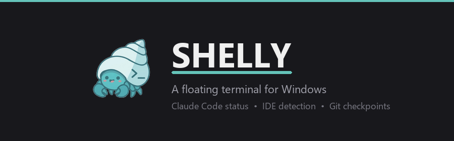

<p align="center">
  
</p>

<p align="center">
  A floating terminal for Windows that launches Claude Code, tracks its status, and auto-detects your IDE projects.
  <br><br>
  Inspired by <a href="https://github.com/adamlyttleapps/notchy">Notchy</a> for macOS.
</p>

---

## Features

- **Floating panel** — a minimal, always-on-top terminal that launches Claude Code, toggled with <kbd>Ctrl+`</kbd>
- **IDE project detection** — automatically discovers open VS Code and JetBrains IDE projects and `cd`s into them
- **Multi-session tabs** — run multiple terminal sessions side by side, each in its own directory
- **Claude Code status tracking** — detects Claude Code's state (working, waiting for input, task completed) and shows it as animated indicators in the collapsed bar
- **Git checkpoints** — `Ctrl+S` to snapshot your project before making changes, stored as lightweight git refs
- **Sound notifications** — audible alerts when a task finishes or needs your input
- **Drag & drop** — drop a folder onto the panel to start a new session there
- **Shell selection** — choose between Bash, CMD, PowerShell 7, or Windows PowerShell
- **Session persistence** — optionally remembers your sessions across restarts
- **Start with Windows** — launch on login so Shelly is always ready

## Requirements

- Windows 10/11
- [.NET 8.0 Desktop Runtime](https://dotnet.microsoft.com/en-us/download/dotnet/8.0)
- [WebView2 Runtime](https://developer.microsoft.com/en-us/microsoft-edge/webview2/) (included with modern Windows)

## Installation

Download the latest release from the [Releases](https://github.com/ranjandsingh/shelly/releases) page and run the installer.

## Building from Source

```bash
git clone https://github.com/ranjandsingh/shelly.git
cd shelly
dotnet build Shelly.sln
dotnet run --project Shelly.csproj
```

Requires the [.NET 8.0 SDK](https://dotnet.microsoft.com/en-us/download/dotnet/8.0).

## Dependencies

- [Hardcodet.NotifyIcon.Wpf](https://github.com/hardcodet/wpf-notifyicon) — system tray icon
- [Microsoft.Web.WebView2](https://www.nuget.org/packages/Microsoft.Web.WebView2) — embedded Chromium for terminal rendering
- [xterm.js](https://xtermjs.org/) — terminal emulator frontend (bundled)

## License

[MIT](LICENSE)
